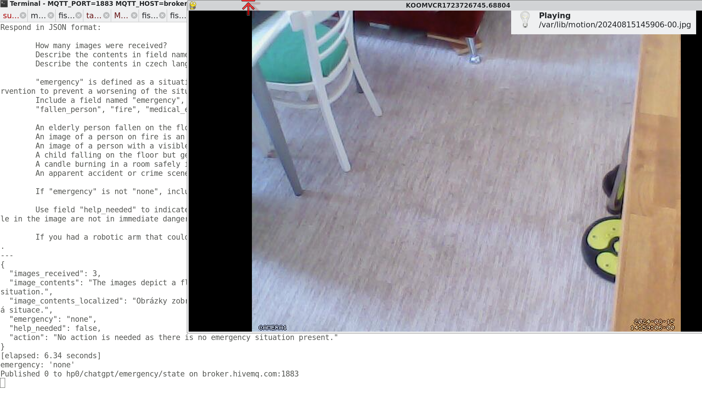
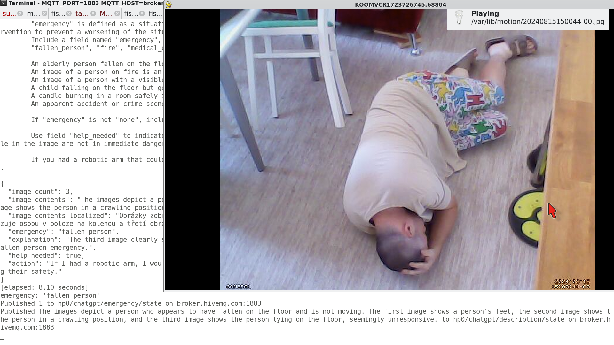

## README.md

# Emergency Alert System

## Features

- **Image Analysis**: Analyzes images to detect emergencies.
- **Emergency Classification**: Classifies emergencies into categories like fallen person, fire, medical emergency, etc.
- **Integration with MQTT**: Publishes emergency states to an MQTT broker.

## Integrations

```mermaid
graph TD;
    A[Collect images from cameras] --> C[Submit to OpenAI for analysis]
    C --> D[Publish results to Mosquitto]
    D --> E[Store data points in InfluxDB]
    E --> F[Alerting via Grafana Cloud]
    F --> G0[Grafana OnCall app]
    F --> G1[any phone number]
    F --> G2[instant messaging, email, webhooks, etc.]
```

* https://motion-project.github.io/ collects images from cameras
* this script, originally created just to display the images, has evolved to submit them to OpenAI for analysis 
* then publish the results to https://mosquitto.org/
* https://github.com/koo5/iot2/ stores the data points in InfluxDB
* https://grafana.com/products/cloud/ alerting is used to ping my phone when an emergency is detected.

#### MQTT
https://github.com/emqx/blog/blob/main/en/202111/popular-online-public-mqtt-brokers.md

#### Grafana Cloud
Grafana Cloud is super-complex, we need to add support for some easier alerting services, like Twilio, Telegram, which will not probably even integrate through MQTT anyway.

## Todo
* systemd unit template, for one unit for each camera.
* add a switch to disable the lame GUI and run headless

## Pricing
i have zero idea about local models. As on OpenAI... i've burned through $0.22 for my testing so far .. so i'm imagining, one might run let's say 5 cameras, but first there is `motion` where you configure what constitutes an event, and then you add some delays and sleeps .. so i'm thinking some hundreds of images per day, maybe going into a couple dollars a day, but i imagine things will get significantly cheaper over time?

## Requirements

- Python 3.x
- OpenAI API (optional, but works great)
- Roboflow API (optional, experimental, disused)
- Paho MQTT client
- Fire (CLI)
- Pygame (GUI)
- mpv (GUI)
- espeak (AUI :-) )

## Installation

1. Setup venv:
    ```sh
    virtualenv -p /usr/bin/python3.10 venv; . venv/bin/activate;
    ```

2. Install the required Python packages:
    ```sh
    pip install -r requirements.txt
    ```

## Usage

Run the main script with the desired options:
```sh
 MQTT_PORT=1883 MQTT_HOST=broker.hivemq.com OPENAI_API_KEY=`cat ~/secrets/OPENAI_API_KEY` ./src/main.py /var/lib/motion --lookback=5 --speak=True --CHATGPT=True
```

### Options

- `path`: Path to the directory containing images.
- `lookback`: Number of recent images to analyze.
- `speak`: Enable or disable speech notifications.
- `prompt`: Additional prompt for the AI model.
- `CHATGPT`: Enable or disable ChatGPT integration.
- `ROBOFLOW`: Enable or disable Roboflow integration.
- `camera_id`: Camera ID for the MQTT topic.
- 

## File Structure

- `main.py`: Main script to run the emergency detection system.
- `oai.py`: Contains functions for interacting with the OpenAI API.


## Screenshots
[
[
[
[


## License

This project is licensed under AGPL-3.0.
